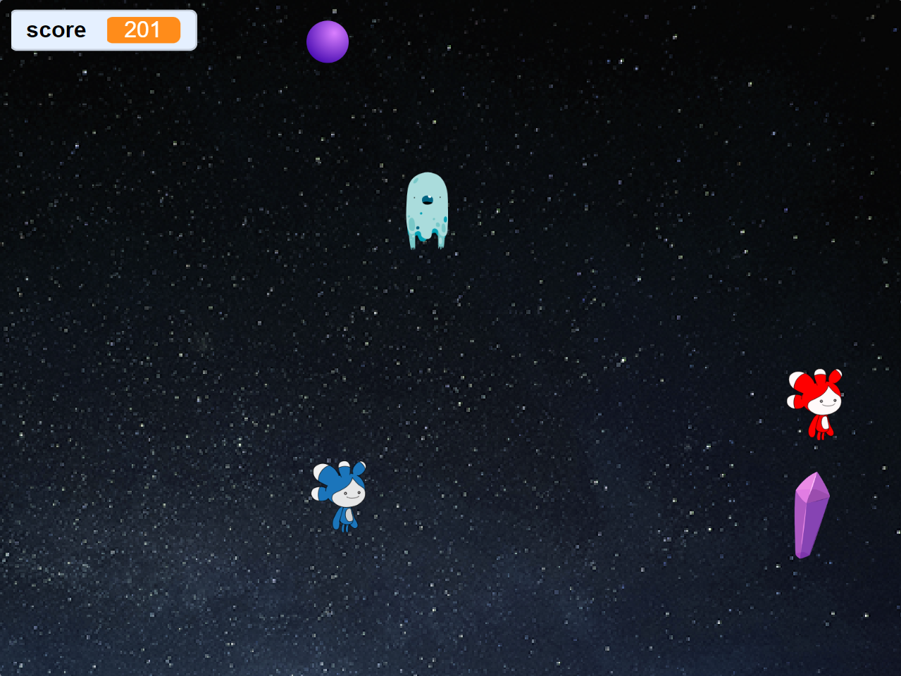

# Space Crystal Game

This is a small game created as a learning exercise on Scratch.

## About

This project is a small demonstration created with Scratch. It's not a complete game or project but rather a small piece to showcase what I've learned.

## How to Use

1. Download the Scratch files.
2. Open the project on Scratch.
3. Click the "Space" button to start the game.

## Notes

This project is a work in progress and may not have all features or functionalities.

<!-- ## License

The project is licensed under the [MIT](LICENSE) license. -->

